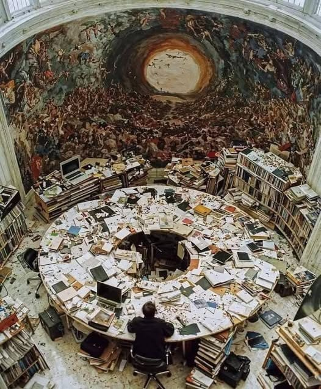

 

    

    <h1>Welcome</h1>

    

        This website is dedicated to be a kind of virtual journal for my thoughts, observation, discoveries, log entries on different projects and to curate arts and music that I like. My github account and contact information can be found in the footer. All of the things posted here are uploaded with little to no editing so there will be grammatical and spelling errors here and there, which is on purpose because with the advent of A.I. people who are incompetent and unread are also able to produce written literature that are grammatically sound but average overall but it takes a human to produce novel things that are rife with HUMAN errors.
    

    

        <a href="/mentalscapes/posts.html">Browse Blog Posts</a>
        <a href="/tags">Browse Tags</a>
        <a href="/collections">Collections</a>
    

